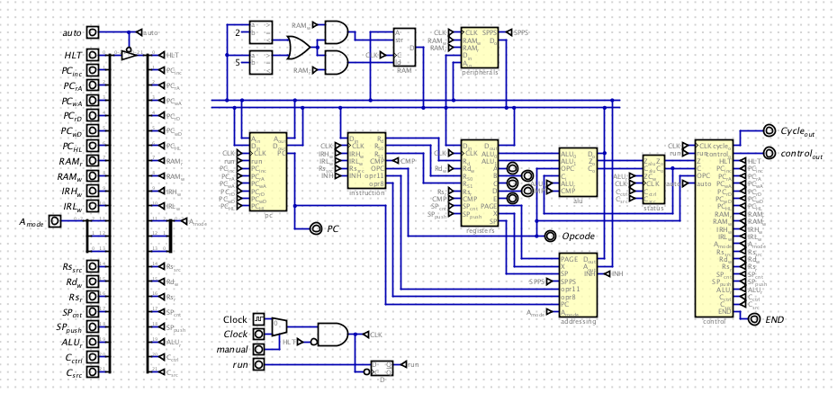

# Digital circuit simulation

CPU simulator using Helmut Neemann's Digital circuit simulator. Software can be downloaded from [github.com/hneemann/Digital](https://github.com/hneemann/Digital). Once downloaded, launch the jar file and open my `cpu.dig` file to load the D8 CPU.

