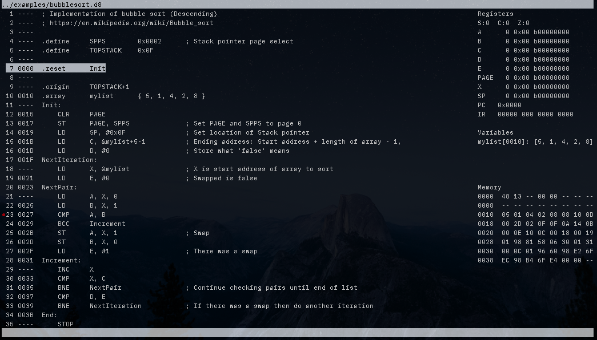

# Example assembly programs

To test the toolchain and CPU I have written a number of small assembly programs.

## Instructions to assemble a program and run CPU emulator

1. Set up your Python virtual environment: `python3 -m venv env` then `source env/bin/activate` then `cd src`
2. Assemble: `python asm.py ../examples/bubblesort.asm`. This generate a `.d8` file used by the emulator
3. Run the emulator in GUI mode: `python gui.py ../examples/bubblesort.d8`
4. Step through the code by pressing `s`. Run to the end by pressing `r`. Reset the CPU by typing `:reset`
5. You can add a breakpoint by `:ba <line number>` like `:ba 23`. Pressing run `r` will halt the CPU at that line number where you can step `s` through the code. Remove a breakpoint `:bd <line number>`
6. `:q` to quit

